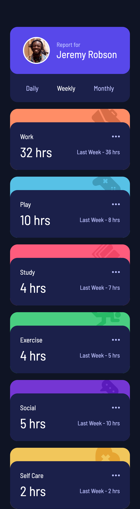
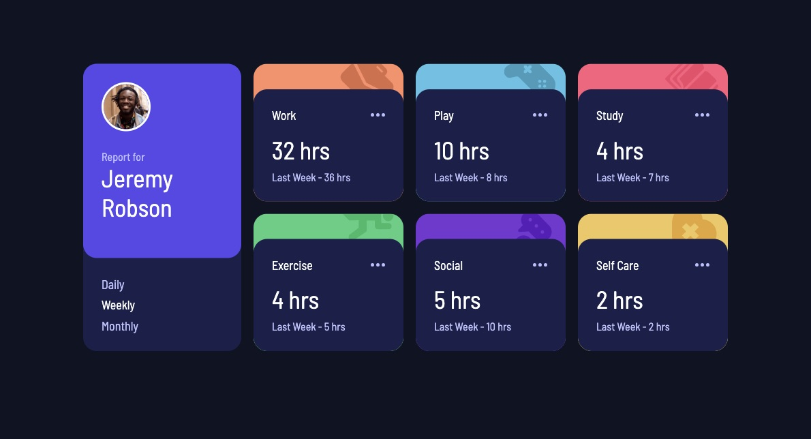

# Frontend Mentor - Time tracking dashboard solution

This is a solution to the [Time tracking dashboard challenge on Frontend Mentor](https://www.frontendmentor.io/challenges/time-tracking-dashboard-UIQ7167Jw). Frontend Mentor challenges help you improve your coding skills by building realistic projects.

## Table of contents

- [Overview](#overview)
  - [The challenge](#the-challenge)
  - [Screenshot](#screenshot)
  - [Links](#links)
- [My process](#my-process)
  - [Built with](#built-with)
  - [What I learned](#what-i-learned)
  - [Continued development](#continued-development)

## Overview

### The challenge

Users should be able to:

- View the optimal layout for the site depending on their device's screen size
- See hover states for all interactive elements on the page
- Switch between viewing Daily, Weekly, and Monthly stats

### Screenshot




### Links

- Solution URL: [GitHub](https://github.com/Ayako-Yokoe/time-tracking-dashboard-main)
- Live Site URL: [Vercel](https://time-tracking-dashboard-eosin-pi.vercel.app/)

## My process

### Built with

- Semantic HTML5 markup
- CSS custom properties
- Flexbox
- CSS Grid
- Mobile-first workflow

### What I learned

I learned a lot through this project. One important lesson was that fetching data returns a promise, and to use the returned data, we need to store it in the proper data type. In this case, I used async and await.

```js
let jsonData = []

// Fetch Data
async function fetchData() {
  try {
    const response = await fetch("./data.json")
    if (!response.ok) {
      throw new Error("Error fetching data")
    }
    jsonData = await response.json()
    displayCards()
  } catch (error) {
    console.log(error)
  }
}

fetchData()
```

### Continued development

Changing the background colors and images dynamically using CSS and JavaScript was a challenge, but I’ll continue to learn and improve my understanding of the logic and coding practices for this.

# time-tracking-dashboard-main
